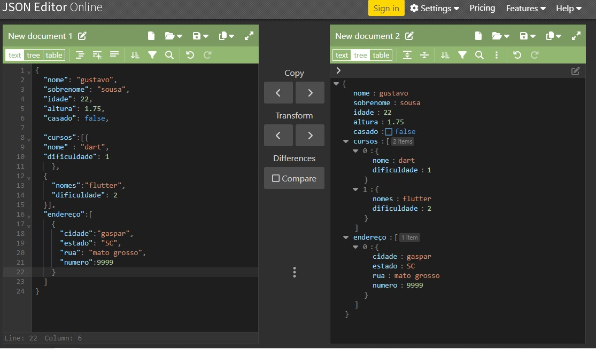
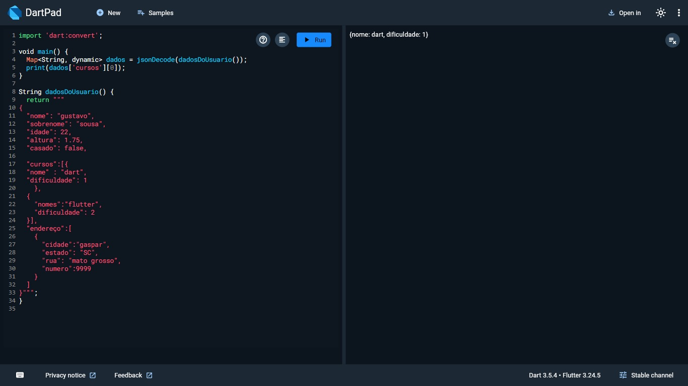

# Projeto JSON para Dart

Exemplo de como converter e manipular dados JSON em Dart.  
Este projeto mostra como transformar uma string JSON em um mapa de dados utilizando a função `json.decode()`,  
e acessar informações específicas, como cursos e endereço de um usuário.

## O que é JSON?

JSON (JavaScript Object Notation) é um formato leve de troca de dados, fácil de ler e escrever para humanos,  
e fácil de analisar e gerar para máquinas. Ele é amplamente utilizado para transmitir dados entre um servidor e um cliente,  
especialmente em APIs web.

## Previews

### Preview JSON

### Preview Dart

